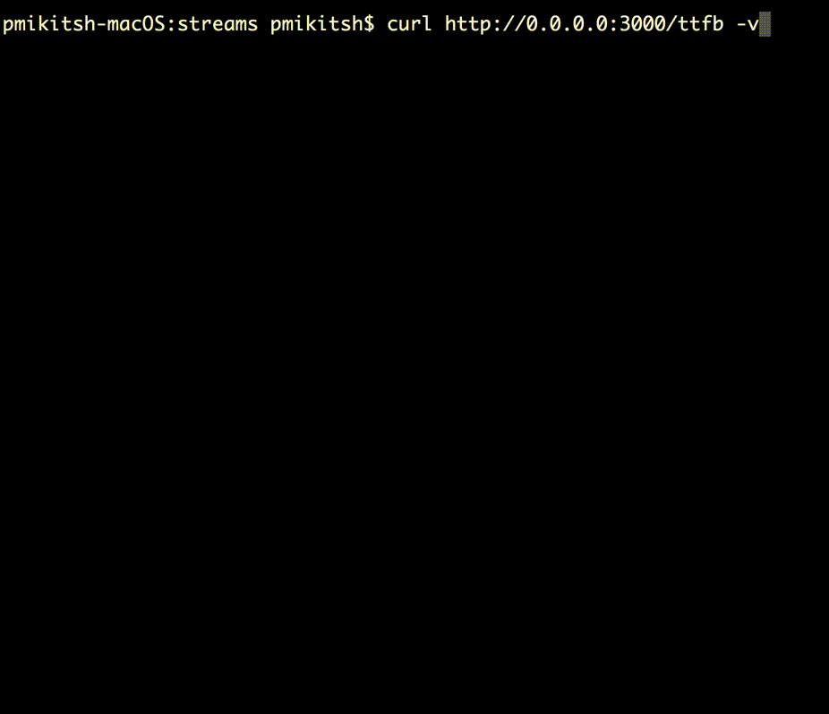
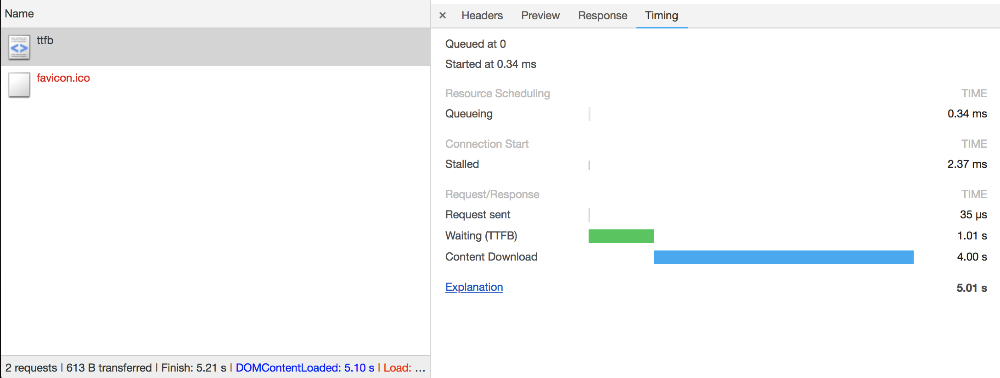

# http-stream

Examples demonstrating the use of NodeJS streams with HTTP.

## Why streams?

Streams are useful when dealing with large quantities of data and properly managing an application's memory footprint.

## Examples

`GET /ttfb`

This shows how streams and TTFB (time to first byte) / TTLB (time to last byte) are related.

After ~1000ms, the first byte is sent. And at ~5000ms, the last byte is sent.





`GET /users`

This endpoint demonstrates how to consume a paginated JSON api and convert it to CSV using streams and piping.

View the comments in the code for more details on how it works.


## Developing

```
npm install
npm start
```
